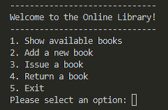
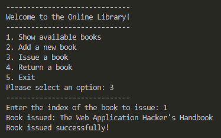
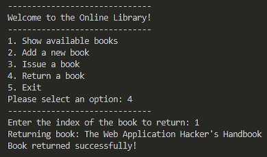

# Java Online Library System 📚

This is a **simple Online Library** simulation program written in Java. It allows users to:
- View available books in the library
- Add new books to the library
- Issue books to users
- Return issued books

The program uses basic Java concepts such as:
- Loops
- Conditionals
- Methods
- Static variables
- Arrays
- Scanner for user input

---

## 🧾 Features

1. ✅ Show Available Books  
2. 📖 Add New Book  
3. 💳 Issue a Book  
4. 🔄 Return a Book  
5. 🚪 Exit the Program

---

## 🔧 How It Works

- The user is shown a menu with options.
- The user selects an option by entering a number.
- Based on the selection, the corresponding method is executed:
  - Show the list of available books.
  - Add a new book to the library.
  - Issue a book (mark it as "not available").
  - Return a book (mark it as "available").
- The program continues running until the user selects "Exit".

---

## 🛠️ Requirements

- Java JDK (version 8 or above)
- A Java IDE like IntelliJ, Eclipse, or simply a text editor + command line

---

## ▶️ Run the Program

1. **Clone the repo**  
```bash
git clone https://github.com/yourusername/Online-Library-System-in-java.git
cd Online-Library-System-in-java
```
2. **Compile and Run**  
```bash
javac OnlineLibrary.java
java OnlineLibrary

```


---

## 📸 Sample Screenshots

### 🧽 Menu


### 📖 Add Book


### 💳 Issue Book


### 🔄 Return Book


---

## 🙌 Author

- **Subham Sidhanta**
- 📧 Instagram: [subham__sidhanta_](https://www.instagram.com/subham__sidhanta_?igsh=MXN6aXYyanNvYWk0cQ==)
- 📧 github: [Subhamsidhanta](https://github.com/Subhamsidhanta)


